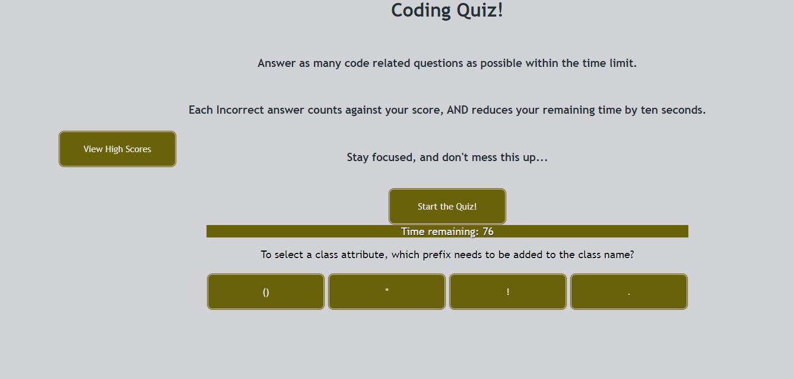

# Code Quiz

Create an application that presents the user with a timed multiple-choice quiz themed around Javascript fundamentals. 

## Requirements

* The quiz is scored. The application must store multiple players' scores and identifiying information 
so that players can compare their results with each other. 

* The user has a limited amount of time to complete the quiz. The countdown timer is initiated when the user clicks the "Start Quiz" button.

* When the "Start Quiz" button is clicked the user will be presented with the first in a series of multiple choice questions. When a question is answered the user is automatically presented with another question.

* Each incorrect answer will result in a ten second deduction from the players remaining time limit. 

* The game is over when all questions are answered or the timer reaches zero.

* When the game is over the player is able to save their initials and score.

## Deployed Application Link

https://ratalla816.github.io/code-quiz/

## Deployed Application Screenshot

#### acknowledgements

* Web APIs Challenge: Code Quiz - KU Coding Bootcamp, Module 4 Challenge Assignment © 2021 Trilogy Education Services, LLC, a 2U, Inc. brand Confidential and Proprietary. All Rights Reserved.

#### MIT License

Copyright (c) 2021 Rob Christopher Atalla

Permission is hereby granted, free of charge, to any person obtaining a copy of this software and associated documentation files (the "Software"), to deal in the Software without restriction, including without limitation the rights to use, copy, modify, merge, publish, distribute, sublicense, and/or sell copies of the Software, and to permit persons to whom the Software is furnished to do so, subject to the following conditions:

The above copyright notice and this permission notice shall be included in all copies or substantial portions of the Software.

THE SOFTWARE IS PROVIDED "AS IS", WITHOUT WARRANTY OF ANY KIND, EXPRESS OR IMPLIED, INCLUDING BUT NOT LIMITED TO THE WARRANTIES OF MERCHANTABILITY, FITNESS FOR A PARTICULAR PURPOSE AND NONINFRINGEMENT. IN NO EVENT SHALL THE AUTHORS OR COPYRIGHT HOLDERS BE LIABLE FOR ANY CLAIM, DAMAGES OR OTHER LIABILITY, WHETHER IN AN ACTION OF CONTRACT, TORT OR OTHERWISE, ARISING FROM, OUT OF OR IN CONNECTION WITH THE SOFTWARE OR THE USE OR OTHER DEALINGS IN THE SOFTWARE.
